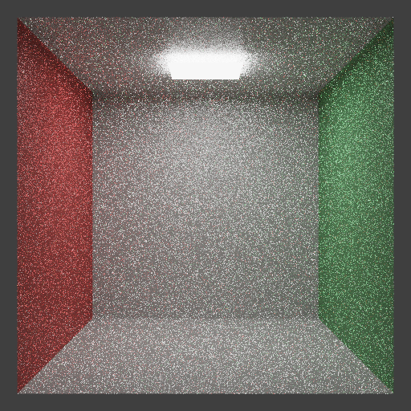

```markdown
# CPU Tracer

A **CPU-based path tracer** written from scratch in **pure C** (with C++-compatible build).

This is my take on building a physically-based renderer entirely on the CPU – no GPU, no heavy dependencies. Everything (vec3/math utils, BVH acceleration, materials, camera) is implemented by hand for maximum learning and control. Only external single-headers used: `stb_image_write.h` for PNG and `tinyexr.h` for HDR EXR output.

The renderer supports path tracing with next-event estimation, depth of field, and a variety of materials. It's fast enough to produce decent images overnight on a laptop.

## Features

- Full **path tracing** with importance sampling
- **BVH acceleration** for quick scene traversal
- Materials: Lambertian (diffuse), Metal, Dielectric (glass), Diffuse Light (emitters)
- Depth-of-field camera
- Custom vec3 and mat3 math library
- Progressive rendering via samples-per-pixel
- Output to both **HDR OpenEXR** and tonemapped **PNG**

## Build

Just need a C compiler (gcc/clang) and make.

```bash
git clone https://github.com/shadow-forge-dev/cpu-tracer-.git
cd cpu-tracer-
make          # produces the 'tracer' executable
```

To clean:
```bash
make clean
```

## Usage

```bash
./tracer [samples_per_pixel] [output_prefix]
```

Examples:
```bash
./tracer 1000 my_render        # 1000 samples, saves my_render.exr + my_render.png
./tracer 500                   # default output files
./tracer                       # quick test with low samples
```

Renders a hardcoded scene (classic Cornell box with spheres and lights).

## Sample Renders

Here's one at ~800 samples:



(HDR version available in repo as `output.exr.hdr`)

## What's Inside

- `main.c` – program entry and scene setup
- `vec3.c/h`, `mat3.c/h` – math utilities
- `ray.h`, `camera.c/h` – ray and DOF camera
- `material.c/h`, `light.c/h` – shading and emission
- `bvh.c/h` – bounding volume hierarchy
- `renderer.c/h`, `sampler.c/h` – core tracing loop
- `scene.c/h` – object management

## License

MIT – use it, tweak it, learn from it.

## Future Ideas

- Multi-threading
- OBJ/scene file loading
- More materials (subsurface, volumetrics)
- Denoising pass

Pull requests welcome if you want to help push it further.

Happy tracing! 
